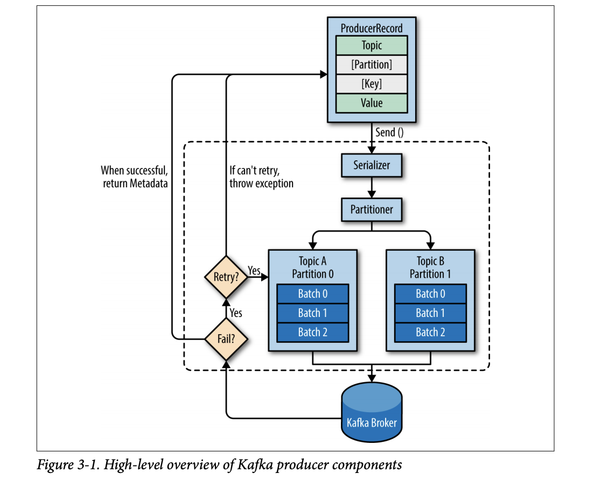
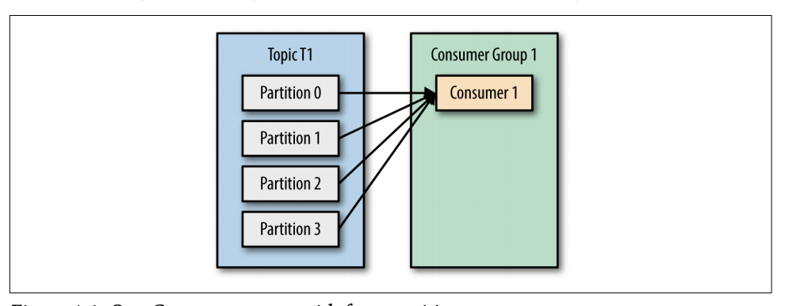
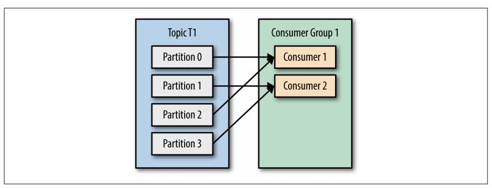
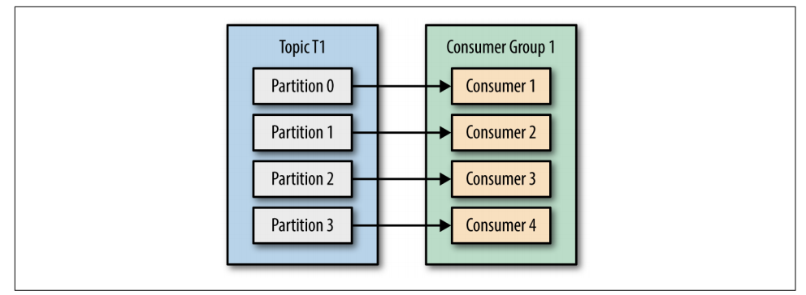
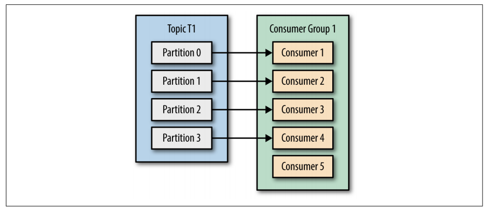
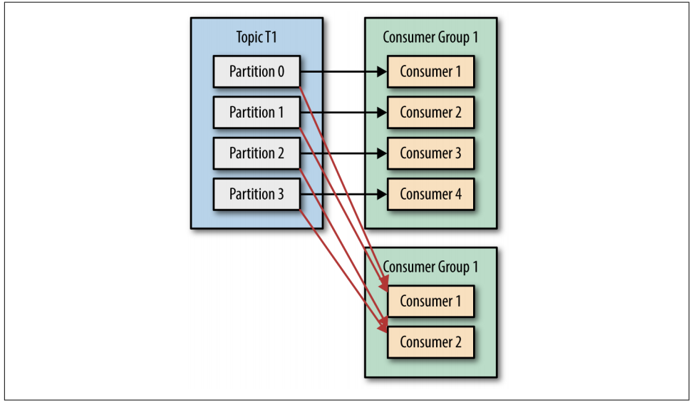
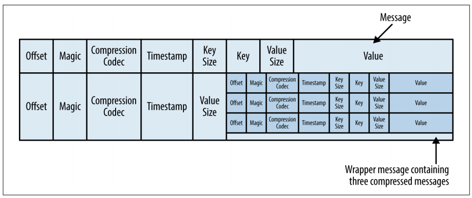
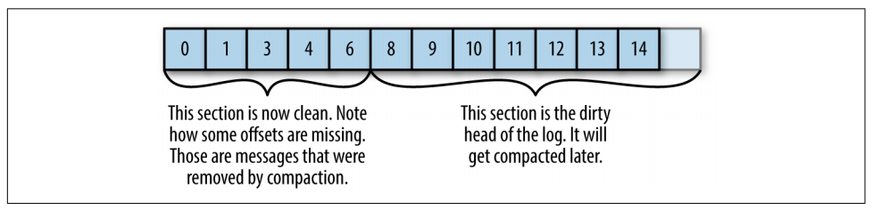

# Kafka- Stream Processing

## Events
- Event is an indication/information of something happening in some time. Ex: a booking getting created, a bid coming in.
- To store entities we use DB, to store events we use logs.
- Log/Topic is a ordered sequence of events. An event happens and we write it to a log with some description of the event.
- Events written to a log can be used by downstream services for further processing and even produce further events to other Topics. 
- Also different some services perform real-time analytics by processing events as soon as they happened.

## Event Streaming
- We have different event-sources like sensors, mobile devices, cloud services.
- Event streaming is the process of:
  - storing these events durably for later retrieval
  - manipulating, processing and reacting to the events in real-time or retrospectively
  
## Kafka
**Event Streaming Platform**
- Functional features:
  - To publish and subscribe to streams of events.
  - To store streams of events durably and reliably for as long as you want.
  - To process streams of events as they occur or retrospectively.

- Non-functional features:
  - distributed, highly scalable, fault-tolerant, secure

### Kafka Architechture
- Kafka is a distributed system consisting of server-client architecture comminucating using a binary protocol over TCP.
  - **Server:** Kafka is run as a cluster of one or more servers that can span multiple datacenters or cloud regions. It is basically where the Kafka brokers are. These clusters are highly scalable and fault-tolerant.
  - **Client:** They allow you to write distributed applications and microservices that read, write, and process streams of events in parallel, at scale, and in a fault-tolerant manner even in the case of network problems or machine failures. Clients are supported for Go, Python etc and also there are REST APIs.
  
### Concepts:
- **Message:** Events are written in Kafka as messages. It is the unit of data in Kafka.
  - Message keys and values are simply array of bytes as far as Kafka is concerned. 
```
Event key: "decision-log-id" (optional)
Event value: "serviceability-log-message"
Event timestamp: "Feb 25, 2020 at 2:06 p.m."
```

- **Batches:** For efficiency, messages are written into Kafka in batches. 
  - A batch is just a collection of messages, all of which are being produced to the same topic and partition. 

- **Topics and Partitions:** 
  - Messages in Kafka are categorized into topics. They are like folders in a filesystem or DB tables. 
  - Topics can grow in size and cause memory issues. So they are broken into `partitions`.
  -  With partitions, there is no guarantee of message time-ordering across the entire topic, just within a single partition.
  -  The term ***stream*** is often used when discussing data within systems like Kafka. A stream is considered to be a single topic of data. 


- **Producers and Consumers** 
  - Producers commits new messages to particular topics.
  - Consumers read commited messages by subscribing to one or more topics.

- **Brokers and Clusters** 
  - A single Kafka server is called a **broker**. 
    - The broker receives messages from producers, assigns offsets to them, and commits the messages to storage on disk.
    - It also services consumers, responding to fetch requests for partitions and responding with the messages that have been committed to disk.
  - Kafka brokers are designed to operate as part of a cluster. 
    - Within a cluster of brokers, one broker will also function as the **cluster controller** (elected automatically from the live members of the cluster).
    - The controller is responsible for administrative operations, including assigning partitions to brokers and monitoring for broker failures.
    - Topics are replicated among the brokers by controlling the replication factor. Recommended value is 3 meaning each partition is replicated 3 times in 3 different brokers.
    - A partition is owned by a single broker in the cluster, and that broker is called the **leader of the partition**.
    - This provides redundancy of messages in the partition, such that another broker can take over leadership if there is a broker failure. 
  - A key feature of Kafka is that of **retention**, which is the durable storage of messages for some period of time as configured in the **Retention Policy**. 
  
### Producers

**Construction a Kafka Producer**
- Create a Producer object with properties. There are 3 mandatory properties.
  - bootstrap.servers - List of host:port pair of brokers
  - key.serializer - 
    - name of class used to serialise key to byte array. With this we can give custom objects to Producer.
    - key.serializer should be set to a name of a class that implements the org.apache.kafka.common.serialization.Serializer interface. 
  - value.serializer.
```
private Properties kafkaProps = new Properties();
kafkaProps.put("bootstrap.servers", "broker1:9092,broker2:9092");
kafkaProps.put("key.serializer", "org.apache.kafka.common.serialization.StringSerializer");
kafkaProps.put("value.serializer", "org.apache.kafka.common.serialization.StringSerializer");
producer = new KafkaProducer<String, String>(kafkaProps); 
```
- Other properties:
  - partitioner.class, 
  - batch.size, 
  - linger.ms, 
  - retries, 
  - acks

**Ways to send a message**
- Fire and forget
- Synchronous Send
- Async Send

**Serializer**
- In-built serializers: ByteArraySerializer , StringSerializer, and IntegerSerializer.
- Custom serializer: Implements org.apache.kafka.common.serialization.Serializer
- 

**Partitioner**
- If Partition-id is given in record, it will be sent to that partition.
- If Key is null and default partitioner is used, record will be sent to partition using Round-Robin algorithm.
- If Key exists and default partitioner is used, Kafka has own hash algorithm to map message to a partition.
- Use custom partitioner by implementing org.apache.kafka.clients.producer.Partitioner.

### Consumers
- Suppose rate at which producers produce the message exceeds rate at which consumers can process them.
-  Just like multiple producers can write to the same topic, we need to allow multiple consumers to read from the same topic, splitting the data between them.
- **Consumer Group**
  - Kafka consumers are typically part of a consumer group. 
  - When multiple consumers are subscribed to a topic and belong to the same consumer group, each consumer in the group will receive messages from a different subset of the partitions in the topic.
  - Suppose there is Topic 1 with 4 partitions. We create a consumer C1 in group G1 and subscribe to T1.

  - Adding C2 to G1, each consumer will get message from 2 partition. Example:

  - Adding 2 more consumers to G1, we will get each consumer reading from a single partition

  - If we add consumers than topics, some of the consumer will be idle and not see any message. Because each partition can be consumed by at most one consumer belong to same consumer group

  - If consumer is performing some high latency operation, it is better to have partitions in topics and consumers consuming from subset of topics. This is a good reason to create topics with a large number of partitions in the first place—it allows adding more consumers when the load increases
  - For multiple applications reading from same topic we need to have separate consumer groups.


**Partition Rebalance**
- Reassignment of partitions happens during addition/removal of a consumer.
- Moving partition ownership from one consumer to another is called rebalancing.
- During a rebalance, consumers can’t consume messages, so a rebalance is basically a short window of unavailability of the entire consumer group.
- Each consumer group has a broker chosen as the group coordinator. Can be different for different groups.
- Each consumer belonging to a group sends a heartbeat signal to the group coordinator and in this way the coordinator knows whether the consumer is alive or not.

**Creating a Kafka Consumer**
- Create a Consumer object with properties. Mandatory properties are: bootstrap.servers, key-deserializer, value-deserializer.
- The fourth important property is group.id
```
Properties props = new Properties();
props.put("bootstrap.servers", "broker1:9092,broker2:9092");
props.put("group.id", "CountryCounter");
props.put("key.deserializer", "org.apache.kafka.common.serialization.StringDeserializer");
props.put("value.deserializer", "org.apache.kafka.common.serialization.StringDeserializer");
KafkaConsumer<String, String> consumer = new KafkaConsumer<StringString>(props);
```
- Subscribing to topics:
```
consumer.subscribe(Collections.singletonList("customerCountries")); 
```
- Other properties: 
  - fetch.min.bytes, 
  - fetch.max.wait.ms, 
  - max.partition.fetch.bytes, 
  - session.timeout.ms, 
  - enable.auto.commit,
  - client.id

**Poll Loop**
- At the heart of the consumer API is a simple loop for polling the server for more data.
- It handles all details of coordination, partition rebalances, heartbeats and data-fetching.
```
try {
  while (true) {
    ConsumerRecords<String, String> records = consumer.poll(100);
    for (ConsumerRecord<String, String> record : records)
    {
      log.debug(record.topic(), record.partition(), record.offset, record.key(), record.value());
      // application logic on the messages
    }
  }
} finally {
  consumer.close()
}
```
- poll( ) returns a list of record from the broker. The records contains the messages along with the topic, partition, offset details. It takes a timeout parameter by which it will return with or without data.

**Commits and Offsets**
- Whenever we call poll( ), it returns records written to Kafka that consumers in our group have not read yet.
- The tracking of which records were read by a consumer of the group is done by offset.
- The offset is another bit of metadata—an integer value that continually increases—that Kafka adds to each message as it is produced. Each message in a given partition has a unique offset.
- Kafka allows consumers to track their position (offset) in each partition
- We call the action of updating the current position (offset) in the partition a commit.
- ***How does a consumer commit an offset?***
  - Consumer sends a message to Kafka server with committed offsets for each partition. Kafka server appends the offsets to a special __consumer_offset topic which is internal to the server.
  - During rebalance, if a consumer is assigned a new set of partition, it will read the latest committed offset for each partition and continue from there.
  - If the committed offset is smaller than the offset of the last message the client processed, the messages between the last processed offset and the committed offset will be processed twice. 
  - If the committed offset is larger than the offset of the last message the client actually processed, all messages between the last processed offset and the committed offset will be missed by the consumer group.
- ***Ways of commits***
  - Automatic commits: If enable.auto.commit is true, consumer will commit the largest offset, it recieved from last poll( ). We can control the interval by auto.commit.interval.ms.
    - Has possibility of message missing and duplication.
  - Commit current offset: By setting auto.commit.offset=false, commits will happen when explicitly called.
    - Synchronous commit API commitSync(): Commits largest offset returned by latest poll( )
    - Asynchronous commit commitAysnc(): has no retry option, can pass a callback
  - Commit specific offset: If poll( ) returns a huge batch, we can commit specific offsets. 
    - commitSync( ) and commitAsync( ) can be passed with a  `Map<TopicPartition, OffsetAndMetadata>` that we want to commit.

**Exiting**
- The consumer polls in an infinite loop. The exit cannot be done from the same thread.
- To exit the poll loop you will need another thread to call consumer.wakeup( )
- Raises WakeupException when the next poll( ) is called.
- Before exit call the consumer.close( ). This will commit offsets if needed and send a message to the group coordinator to start rebalancing.

**Further Reads: 1. Rebalance Listeners, 2. Consuming records with specific offset.**

### Kafka Internals

**Replication**
- Kafka is a “a distributed, partitioned, replicated commit log service.” 
- In Kafka each topic is partitioned and partitions can have multiple replicas. These replicas are distributed over the brokers.
- Types of replicas:
  - **Leader Replica:** Each partition has a single replica designated as the leader. All produce and consume requests go through the leader, in order to guarantee consistency.
  - **Follower Replicas:** All replicas that are not leader are follower replicas. Their job is to replicate messages from the leader and stay up-to-date. In event of the leader replica crashing, one of the follower replicas become the leader.
- Leader replica keeps track with which follower is up-to-date with the leader.
- Inorder to stay in sync, the followers send the leader with Fetch request similar to the consumer's requests. The Fetch request contains the offset of the message the replica wants to recieve next, and will always be in order.
- By looking at the last requested offset, the leader will know how much far behind the replicas are. 
- If a replica hasn’t requested a message in more than 10 seconds or if it has requested messages but hasn’t caught up to the most recent message in more than 10 seconds, the replica is considered out of sync. Out-of-sync replicas cannot become leader in event of failure.
- The replicas that keep up with the leader are in-sync replicas.
- If the number of in-sync replicas becomes less than desired min.insync.replicas, producers attempting to send data will recieve NotEnoughReplicasException. This is a trade-off between availability and reliability.
  
**Physical Storage**
- **Retention:** Kafka has defined retention period for a topic
  - the amount of time to store messages before deletion
  - how much data to store before older messages are purged.
- Because finding the messages that need purging in a large file and then deleting a portion of the file is both time-consuming and error-prone, Kafka splits each partition into segments. Each segment is stored in a file.
- By default, each segment contains either 1 GB of data or a week
of data, whichever is smaller.
- The segment currently being written to is the active segment. No deletion takes place on the active segment.
- A Kafka broker will have open file handle to every segment in every partition. This means a high numbe of file handlers and OS must be tuned accordingly.
- **File format:** Each segment is stored in a single data file Inside the file, we store Kafka messages and their offsets. The format of the data on the disk is identical to the format of the messages that we send from the producer to the broker and later from the broker to the consumers. 
  - ***Using the same message format on disk and over the wire is what allows Kafka to use zero-copy optimization when sending messages to consumers and also avoid decompressing and recompressing messages that the producer already compressed.***
  - Message format:
    - Normal message
    - Wrapper message

 - **Indexes:** Kafka allows consumer to consume from any offset. 
   - So when a request comes it has to quickly locate the offset and start reading messages from the offset.
   - Kafka maintains an index for each partition mapping segment files to offsets within the file.
   - Indexes are also broken into segments so that older index entries can be deleted when messages are purged.

**Compaction**
- In some applications, it is needed only to have the most recent value for each key in a topic.
- Usecase: useful for restoring state after crash of an in-memory service, reloading a cache. When recovering from crash, the application reads the log messages to recover the last state.
- Kafka supports such use-cases by allowing the retention policy to be compact(stores the recent value for each key in topic) instead of delete.
- Each log is split into 2 portion: 
  - Clean: Messages in this part have been compacted before. Contains one value per key, the most recent one.
  - Dirty: Messages written after last compaction.

- During compaction, the dirty portion is processed and the partition is cleaned.
- Deletion: 
  - In order to delete a key completely from the system, the application needs to produce a message containing the key and a null value. 
  - During compaction, the message with the null value is retained against the key. 
  - It will keep this special message (known as a tombstone) around for a configurable amount of time. 
  - After a set amount of time, Kafka will remove the tomb stone message from the partition and the key will be gone.
- The Kafka internal __consumer_offset topic is a compact topic.